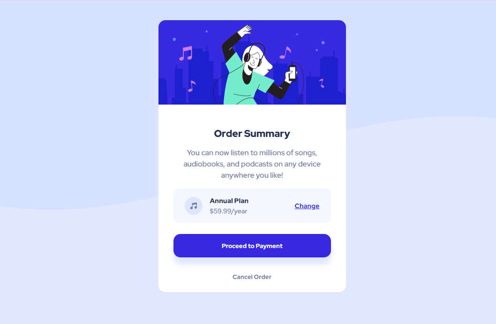

# Order summary card

## Table of contents

&nbsp;&nbsp; ▪️ [Overview](#overview)   
&nbsp;&nbsp; ▪️ [The challenge](#the-challenge)  
&nbsp;&nbsp; ▪️ [Screenshot](#screenshot)  
&nbsp;&nbsp; ▪️ [Links](#links)  
&nbsp;&nbsp; ▪️ [My process](#my-process)  
&nbsp;&nbsp; ▪️ [Built with](#built-with)  
&nbsp;&nbsp; ▪️ [Author](#author)  

## Overview

This is my first frontendmentor.io challenge.

### The challenge

Users should be able to:

- See hover states for interactive elements

### Screenshot

### Links

- Solution URL: [View my solution](https://github.com/lizzencamelo/Responsive-HTML-and-CSS-Card-Component)
- Live Site URL: [Card-Component](https://lizzencamelo.github.io/Responsive-HTML-and-CSS-Card-Component/)

## My process

Setting up the HTML Page.
CSS styling responsive mobile first approach followed by desktop approach.
Reviewing code.

### Built with

- Semantic HTML5 markup
- CSS custom properties
- Flexbox
- Mobile-first workflow

## Author | @[lizzencamelo](https://www.frontendmentor.io/profile/lizzencamelo)
